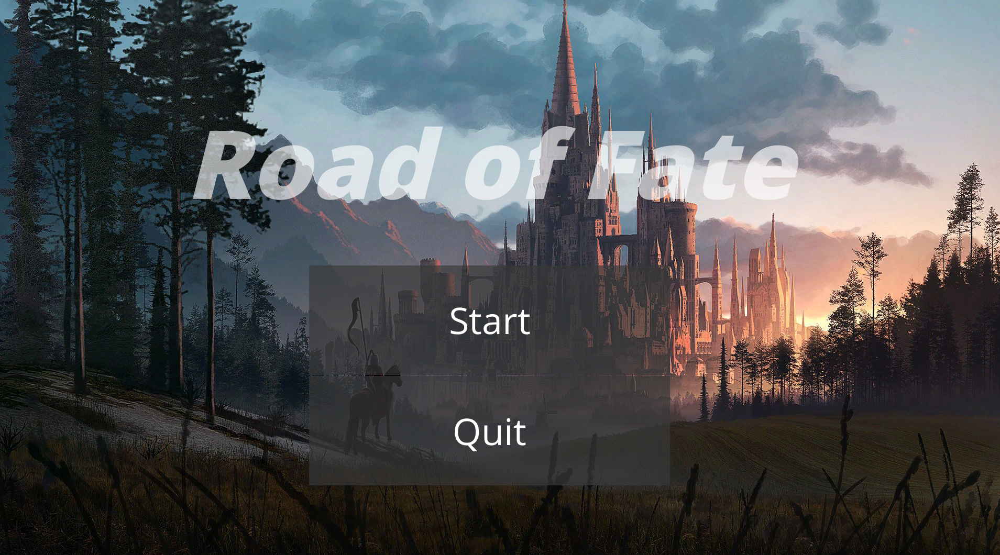

# Road Of Fate

## Overview

Road Of Fate is a Unity-based game project. It is a preliminary version of a mixture of top-down / platformer game with levels. This repository contains all the necessary assets, scripts, and settings required to run and develop the game.

## Gameplay Demo

### Top Down

### Platformer

## Introduction

Road Of Fate is designed as a hybrid of top-down and platformer gameplay styles. Players navigate through levels, overcoming obstacles and enemies to progress further into the game.

## Current Menu

## Features

- <b>Top-Down View</b>:
- <b>Platformer Elements</b>: Engage in platforming challenges that test your reflexes and timing.
- <b>Multiple Levels</b>: Experience diverse levels with unique designs and challenges.

### GamePlay Elements

- <b>Item Pickup</b>
  
- <b>Dialogue</b>
  
- <b>Fighting</b>
  

## Contributing

Contributions are welcome! Please follow these steps to contribute:

1. Fork the repository.
2. Create a new branch for your feature or bugfix.
3. Make your changes and commit them with descriptive messages.
4. Push your changes to your forked repository.
5. Create a pull request to merge your changes into the main repository.

## Further Development

1. Overall improvement
2. Boss Fight
3. Inventory System
4. Skill System
5. AI Improvement
6. TBD...
